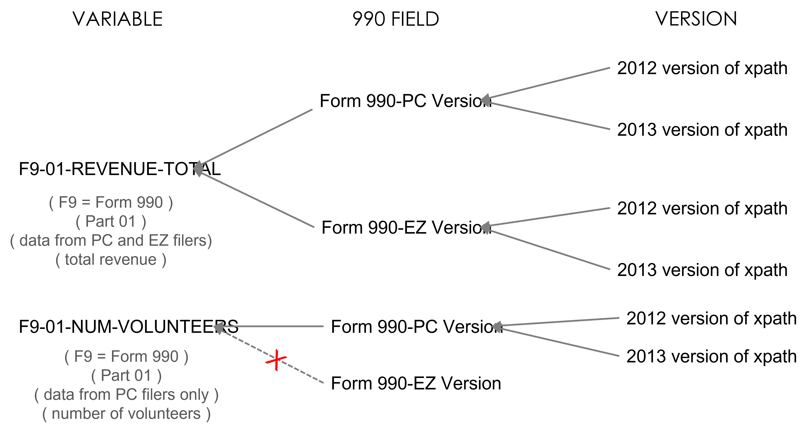
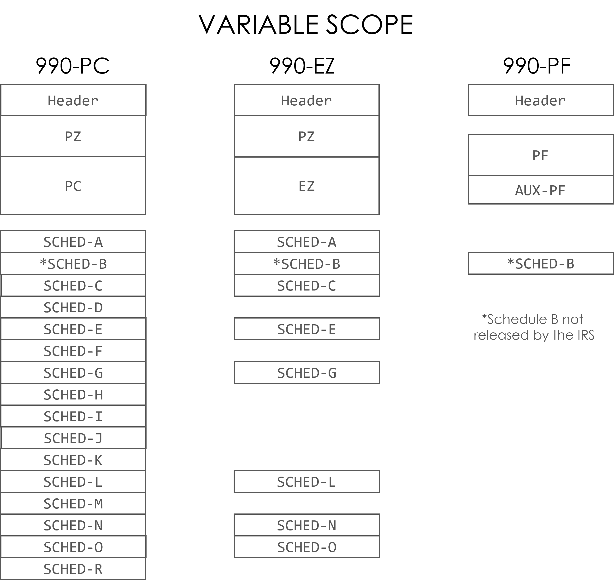

```{r setup, include=FALSE}
knitr::opts_chunk$set( message=FALSE, warning=FALSE, comment=FALSE )

library( knitr )
library( dplyr )
library( pander )
# library( kableExtra )


# output: 
#   pdf_document:
#     toc: true
#     number_sections: false
# classoption: landscape
```


<br>
<hr>
<br>

### Concordance Files

This data dictionary provides documentation for all of the variables contained within a research database built using the [Master Concordance File](https://nonprofit-open-data-collective.github.io/irs-efile-master-concordance-file/). 

The concordance file provides a crosswalk structure to map data from any version of each form (990 or 990-EZ) into a consistent set of variables organized into tables that correspond with 990 form sections ("parts"). 



If you discover errors in the data please submit a ticket. 


### Variable Names

There are over 6,500 unique variables across all 990 forms and schedules. 

The variable naming convention uses the following rules: 

* The prefix identifies the origin of the variable (form and part) 
* Groups of variables use the NOUN-ADJECTIVE convention so that groupings are clear 
  - Correct:  address-street, address-city, address-state (ORG_ADDR_CITY)
  - NOT: street-address, city-address, state-address  
* Variables describing check-boxes end in an _X 
* All variable names are less than 32 characters in length 

A table of common abbreviations used in variable names appears at the end of this document for reference. 


#### Variable Prefix

The variable names have the form **XX_XX_NAME** where the first four characters represent the prefix. 

The variable prefix indicates the LOCATION of the variable on the 990 forms and schedules.

**First two XX's indicate the form**:  

* F9 - Variable occurs on Form 990 or 990-EZ  
* SA through SR - Variable occurs on Schedule A to Schedule R
* PF - Variable is from the 990-PF filed by private foundations 
* AF - Auxillary schedule for PF filers  


**The second two XX's indicate the PART**: 

Each form and schedule is sub-divided into Parts. 

* 00 - Variable occurs outside of a section ("Part") on the 990 form, typically the header   
* 01 - Variable occurs in Part I of the form   
* 02 - Variable occurs in Part II of the form  
* Etc.  


For example: 

* F9_01_**REV_TOT_CY**: total revenue from the current year, reported in Part-01 of Form 990 (F9-01). 
* F9_01_**REV_TOT_CY**: total revenue from the prior year, reported in Part-01 of Form 990 (F9-01). 
* F9_09_**EXP_GRANT_US_ORG_TOT**: total grants made to domestic organizations, reported in Part-09 (expenses) of Form 990 (F9-09). 
* F9_09_**EXP_GRANT_US_INDIV_TOT**: total grants made to foreign organizations, reported in Part-09 (expenses) of Form 990 (F9-09). 
* SJ_02_**COMP_DTK_BASE_ORG**: base compensation of director, trustee or key employee paid by the organization, reported in Part-02 of Schedule J  (SJ-02).  
* SJ_02_**COMP_DTK_BASE_RLTD**: base compensation of director, trustee or key employee paid by a related organization, reported in Part-02 of Schedule J (SJ-02).  


The prefix is necessary because some concepts appear frequently across several forms, for example address fields. The location prefix is included to avoid variable disambiguation problems during use. 

The prefix can be easily dropped to make variable names easier to use after all required tables have been joined. 


### SCOPE

The variable scope will tell you whether a particular nonprofit reported information regarding the variable depending on the version of the 990 form they used. Specifically: 

* PZ - Variable relevant to BOTH full 990 and 990-EZ nonprofit filers
* PC - Variable relevant ONLY to full form 990 nonprofit filers  
* EZ - Variable relevant ONLY to 990-EZ nonprofit filers  

For example,   

Also:

* HD - Header and signature block variables that are identical across PC, EZ, and PF forms 
* PF - Variables relevant only to foundations  




### Tables 

The concordance file organizes each PART into one or more tables. 

Table-00 will contain the ONE-TO-ONE variables in each PART.

Table-01, Table-02, etc. will contain the ONE-TO-MANY tables embedded in the 990 forms. 

Table-99's are supplementary tables included at the end of most forms and schedules as a place for extended explanations, comments, or attachments that don't fit in the regular sections of the 990. 

ONE-TO-ONE cardinality means each nonprofit can only provide one unique answer for the question, e.g. what is your EIN or the total revenue for the current year.

ONE-TO-MANY cardinality means that an organization can report more than one value for the question. For example, in Part VII when the nonprofit enumerates board members it will provide multiple answers for the question "board member name".

The **URL** field that contains the HTML address of the XML form for each unique filing serves as the **unique key** for merging tables. The EIN field is the unique ID for each organization and the EIN-TaxYear pair has the potential to be a unique key combination, but if an organization has filed an amendment they EIN-TaxYear pair is not longer unique. The URL will always be unique. 


### Topics 

The 990 Forms and Schedules are divided into PARTS, which organize the fields by themes.


#### Form 990

* Part I    - Summary  
* Part II   - Signature Block  
* Part III  - Statement of Program Service Accomplishments  
* Part IV   - Checklist of Required Schedules  
* Part V    - Statements Regarding Other IRS Filings and Tax Compliance  
* Part VI   - Governance, Management, and Disclosure  
    * Section A. Governing Body and Management  
    * Section B. Policies  
    * Section C. Disclosure  
* Part VII  - Compensation of Officers, Directors, Trustees, Key Employees, Highest Compensated Employees, and Independent Contractors  
    * Section A. Officers, Directors, Trustees, Key Employees, and Highest Compensated Employees  
    * Section B. Independent Contractors  
* Part VIII - Statement of Revenue  
* Part IX   - Statement of Functional Expenses  
* Part X    - Balance Sheet  
* Part XI   - Reconciliation of Net Assets  
* Part XII  - Financial Statements and Reporting  
 
#### Schedules
  
* schedule a - public charity status and public support (pc and ez filers) 
* schedule b - schedule of contributors (pc, ez, and pf filers)  
* schedule c - political campaign and lobbying activities (pc and ez filers)  
* schedule d - supplemental financial statements (pc filers only)  
* schedule e - schools (pc and ez filers)  
* schedule f - statement of activities outside the united states (pc filers only)  
* schedule g - supplemental information regarding fundraising or gaming activities (pc and ez filers)  
* schedule h - hospitals (pc filers only)  
* schedule i - grants and other assistance to organizations, governments, and individuals in the united states (pc filers only)   
* schedule j - compensation information (pc filers only)  
* schedule k - supplemental information on tax-exempt bonds (pc filers only)  
* schedule l - transactions with interested persons (pc and ez filers)  
* schedule m - noncash contributions (pc filers only)  
* schedule n - liquidation, termination, dissolution, or significant disposition of assets (pc and ez filers)  
* schedule o - supplemental information to form 990 or 990-ez  
* schedule r - related organizations and unrelated partnerships (pc filers only) 


```{r, echo=FALSE}
# dat1 <- read.csv("f990-part-00.csv")
# dat2 <- read.csv("f990-part-01.csv")
# dat3 <- read.csv("f990-part-03.csv")
# dat4 <- read.csv("f990-part-08.csv")
# dat5 <- read.csv("f990-part-09.csv")
# dat6 <- read.csv("schedule-j.csv")
# dat <- dplyr::bind_rows( dat1, dat2, dat3, dat4, dat5, dat6 )


setwd("csv")
file.names <- dir()
file.names <- grep( "*.csv$", file.names, value=TRUE )
# setwd("..")


# setwd("C:/Users/jdlec/Dropbox (Personal)/00 - Nonprofit Open Data/14 - Revisions to Concordance/SUMMERGRANT/concordance-revisions/concordance-files/csv2/csv")


dat <- NULL

for( i in file.names )
{
  d <- read.csv( i )
  
  # if( ( setdiff( names(d), nm ) %>% length() > 0 )  | (  setdiff( nm, names(d) ) %>% length() > 0 )  ) 
  # {
  #   print(i)
  #   break
  # }
  dat <- dplyr::bind_rows( dat, d )
}

names( dat ) <- toupper( names( dat ) )

# use location codes if family code is missing 
dat$LOCATION_CODE_FAMILY[ is.na(dat$LOCATION_CODE_FAMILY) ] <- 
  dat$LOCATION_CODE[ is.na(dat$LOCATION_CODE_FAMILY) ]

# remove special characters that will 
# wreck table formatting like ($) 
dat$DESCRIPTION <- gsub( "\\(\\$\\)[ ]{0,1}", "", dat$DESCRIPTION )
```


```{r, eval=F, echo=F}
unique( dat$RDB_TABLE )
```


```{r, echo=F, results="asis"}


# html_table_width <- function( kable_output, width )
# {
#   width_html <- paste0(paste0('<col width="', width, '">'), collapse = "\n")
#   sub('<table>', paste0('<table class="table">\n', width_html), kable_output )
# }

html_table_width <- function( kable_output, width )
{
  width_html <- paste0(paste0('<col width="', width, '">'), collapse = "\n")
  sub('<table>', paste0('<table class="table">\n', width_html), kable_output )
}


for( i in unique(dat$RDB_TABLE) )
{
  
  # flush.console()   # print during a loop
  
  dat.sub <- dplyr::filter( dat, RDB_TABLE == i )
  
  d1 <- dat.sub[1,]
  
  t1 <- substr( d1$RDB_TABLE, 9, 10 )
  t2 <- substr( d1$RDB_TABLE, 12, nchar(d1$RDB_TABLE) )
  table.name <- paste0( "## ", d1$FORM, "  •  ", d1$FORM_PART, "  •  TABLE-", t1, "  •  ", t2 ) 
  
  writeLines( paste0( "\n",table.name, " \n" ) )
  
  writeLines( paste0( "##### RDB Table Cardinality: ONE-TO-", d1$RDB_RELATIONSHIP, "\n" ) )
  writeLines( paste0( "##### Table Name:  ", i, "\n" ) )
  
  dat.sub$PREFIX <- substr( dat.sub$VARIABLE_NAME, 1, 6 )
  dat.sub$VARIABLE_NAME <- substr( dat.sub$VARIABLE_NAME, 7, nchar(dat.sub$VARIABLE_NAME) )
  dat.sub$VARIABLE_NAME <- paste0( "<b>", dat.sub$VARIABLE_NAME, "</b>" )
  dat.sub$SCOPE <- dat.sub$VARIABLE_SCOPE
  
  d1 <- 
    dat.sub %>% 
    select( VARIABLE_NAME, LOCATION_CODE ) %>% 
    unique( ) %>% 
    arrange( VARIABLE_NAME, desc(LOCATION_CODE) ) %>% 
    group_by( VARIABLE_NAME ) %>% 
    mutate( LC=paste0(LOCATION_CODE, collapse=";<br>") ) %>% 
    ungroup() %>% 
    select( VARIABLE_NAME, LC ) %>% 
    unique( )
  
  names(d1) <- c("VARIABLE_NAME","LOCATION_CODE")
  
  d2 <- 
  dat.sub %>% 
  select( PREFIX, VARIABLE_NAME, DESCRIPTION, LOCATION_CODE_FAMILY, SCOPE ) %>%
  arrange( LOCATION_CODE_FAMILY, VARIABLE_NAME ) %>% 
  select( -LOCATION_CODE_FAMILY )
  
  d3 <- 
    merge( d2, d1, by="VARIABLE_NAME", all.x=TRUE ) %>% 
    select( PREFIX, VARIABLE_NAME, DESCRIPTION, LOCATION_CODE, SCOPE ) %>% 
    arrange( LOCATION_CODE )
  
  d3 <- d3[ ! duplicated(d3$VARIABLE_NAME), ]
  row.names( d3 ) <- NULL
  
  writeLines( "<br>" )
  
  cat( kable( d3, format="html", escape=F ) %>% 
         html_table_width( c("10%","20%","30%","30%","10%") ) ) 
  
  writeLines( "<br><hr><br>" )

  
}
  
```


##  Abbreviations Used in Variable Names 

Common abbreviations used in variable names: 

```{r, echo=F}
URL <- "https://docs.google.com/spreadsheets/d/e/2PACX-1vQFwGSBmlSehGATDOSu0dIx25BMLnyDszJvTEztvnRhmNtHR-CMnb4I6C2T9egXohUtvrhnNG_kD3Ki/pub?gid=0&single=true&output=csv"
ab <- read.csv( URL )
kable( ab )
```


<style>

ul a:hover {
  color: #337ab7;
  text-decoration: none;
  font-weight: normal;
} 


#TOC ul {
  font-size:calc(0.75em + 0.25vw);
  line-height:1.4;
  font-weight: bold;
  list-style: none;
  counter-reset: awesome-counter;
  list-style-position: outside;
  padding-left: 0;
  margin-left: 0;
} 

#TOC ul li {
  list-style-type: none;
  font-size:calc(0.75em + 0.25vw);
  line-height:1.4;
  font-family: monospace;
  margin: 1px 0;
  counter-increment: awesome-counter;
  list-style-position: outside;  
}  
#TOC a {
  color: black;
  font-size:calc(0.75em + 0.25vw);
  line-height:1.4;
  font-weight: normal;
}  
#TOC a:hover {
    color: black;
    text-decoration: none;
    font-weight: bold;
}

#TOC ul li::before {
  content: counter(awesome-counter) ".   ";
  color: #995c00;
  font-weight: bold;
  text-align: right;
  display: inline-block; 
  width: 45px; 
  padding-right: 10px;
}


</style>


