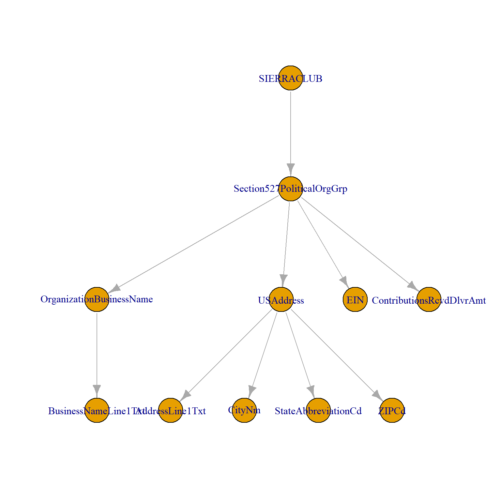

## Instructions 

Ignore all one-to-one tables (T00 or T99).  

Test and validate rdb-build() functions for all one-to-many tables (bolded below): 
* Create a sample of 25 organizations and try building each RDB table for the sample. 
* Save your sample so that we can replicate problems you might encounter (see dput() in the script below).
* If the functions work, inspect the table to validate results by comparing values in the table to values reported on the 990 forms. 
  - Start from the bottom of the table - you are more likely to detect row noncongruence at the bottom. 
  - You can compare against the raw XML form or by looking up the return on [ProPublica's Nonprofit Explorer](https://projects.propublica.org/nonprofits/advanced_search). 
  - Spot check 3-5 organizations in the table. 
* If the table appears to be fine save the table as a CSV in this folder and add a checkmark [X] beside the table name below. 
* If there are errors or you find issues with the data make a note beside the table below and create a new R script with the tables name and your code that reproduces the error. 

If you are examining tables in Schedules, a random sample of 25 orgs might not work because there are only a couple of schedules that are regularly required. Instead, you can use this table of schedules to identify museums that have filed a specific schedule and sample from that. Schedule H is specific to hospitals and Schedule E is specific to schools so you likely won't have any of those cases: 

* [list of schedules filed by museums](https://www.dropbox.com/s/mqui4j9ke2isuqm/SCHEDULES.csv?dl=0)  

```r
index <- read.csv( "SCHEDULES.csv" )
index.b <- dplyr::filter( index, SCHEDB )
sample.b <- dplyr::sample_n( index.b, 25 )
dput( sample.b )  # save this so results can be replicated 

test.urls <- sample.b$URL
```

[RDB Functions](https://github.com/Nonprofit-Open-Data-Collective/irs990efile/blob/main/R/rdb-functions-v2.R)

* find_group_names() searches for parent nodes of the table.  
* validate_group_names() creates a list of all of the nodes in the XML form matched by the group names, then checks whether all of those nodes are in the specific RDB table of interest. It is called within get_table(). 
* get_table() uses the group names from find_group_names() and extracts all XML tables with matching parent nodes, then converts them to rectangular data tables. 
* get_var_map() generates a crosswalk in order to convert all of the XML variable names to the correct concordance variable names so tables can be stacked, no matter which version of XML they were generated from. 
* re_name() applies the crosswalk from get_var_map() to rename variables. 
* build_rdb_table() uses all of the steps above to create rectangular data tables, and it also adds all of the keys needed to join this table to others in the relational database (object ID, URL, nonprofit name, nonprofit EIN, type of tax form (990,990EZ), and year (tax year). 


```r
library( irs990efile )
library( dplyr )


dropbox <- "https://www.dropbox.com/s/flxlppoj5u1vmzd/index-museum.rds?dl=1"
index <- readRDS(gzcon(url( dropbox )))


# Create a sample: 

test.index <- dplyr::sample_n( index, 25 ) )

# dput( test.index )  # save your sample so we can reproduce errors 

test.urls <- test.index$URL 


# see all table names: 
# table( concordance$rdb_table, concordance$rdb_relationship )
# for example: 
# F9-P03-T01-PROGRAMS
# F9-P07-T02-CONTRACTORS 
# F9-P07-T01-COMPENSATION

# view all xpaths in the table 
concordance$xpath[ concordance$rdb_table == "F9-P03-T01-PROGRAMS" ]


# check possible parent nodes 
find_group_names( table.name="F9-P03-T01-PROGRAMS" )
find_group_names( table.name="F9-P07-T01-COMPENSATION" )
find_group_names( table.name="F9-P07-T02-CONTRACTORS" )


# map to standardize variable names across table versions 
get_var_map( table.name="F9-P07-T01-COMPENSATION" )


table.name <- "F9-P07-T01-COMPENSATION"

results.list <- list()

for( i in 1:length(test.urls) )
{
  url <- test.urls[i]
  results.list[[i]] <- build_rdb_table( url, table.name )
}


df <- bind_rows( results.list )

write.csv( df, paste0( table.name, ".csv", row.names=F )
```


## Annotated Examples

These examples are using older code so the functions will not be identical, but it shows how to map XML table structures if the default build_rdb_table() is not working. 

* [Schedule C Example](https://nonprofit-open-data-collective.github.io/irs990efile/rdb-tables/sched-c-rdb-tables-v3.html)     
* [Schedule H Example](https://nonprofit-open-data-collective.github.io/irs990efile/rdb-tables/sched-h-rdb-tables.html)  

Example of a fairly well-structured table where Section527PoliticalOrgGroup is the parent node for the table or the "group name" from find_group_names(). 




## Nachiket

  [1] "F9-P00-T00-HEADER"                             
  [2] "F9-P01-T00-SUMMARY-EZ"                         
  [3] "F9-P01-T00-SUMMARY"                            
  [4] "F9-P02-T00-SIGNATURE"                          
  [5] "F9-P03-T00-PROGRAMS"                           
  [6] "F9-P03-T00-MISSION"                            
  **[7] "F9-P03-T01-PROGRAMS"**                           
  [8] "F9-P04-T00-REQUIRED-SCHEDULES-EZ"              
  [9] "F9-P04-T00-REQUIRED-SCHEDULES"                 
 [10] "F9-P05-T00-OTHER-IRS-FILING"                   
 [11] "F9-P06-T00-GOVERNANCE-EZ"                      
 [12] "F9-P06-T00-GOVERNANCE"                         
 [13] "F9-P07-T00-DIR-TRUST-KEY"                      
 **[14] "F9-P07-T02-CONTRACTORS"**                        
 **[15] "F9-P07-T01-COMPENSATION"**                       
 **[16] "F9-P07-T01-COMPENSATION-HCE-EZ"**                
 **[17] "F9-P99-T01-COMPENSATION"**                       
 [18] "F9-P08-T00-REVENUE"                            
 **[19] "F9-P08-T01-REVENUE-PROGRAMS"**                   
 **[20] "F9-P08-T02-REVENUE-MISC"**                       
 [21] "F9-P09-T00-EXPENSES"                           
 **[22] "F9-P09-T01-EXPENSES-OTHER"**                     
 [23] "F9-P10-T00-BALANCE-SHEET"                      
 [24] "F9-P11-T00-ASSETS"                             
 [25] "F9-P12-T00-FINANCIAL-REPORTING"                
 [26] "SA-P00-T00-HEADER"                             
 [27] "SA-P01-T00-PUBLIC-CHARITY-STATUS"              
 **[28] "SA-P01-T01-PUBLIC-CHARITY-STATUS"**              
 [29] "SA-P02-T00-SUPPORT_SCHEDULE_170"               
 [30] "SA-P03-T00-SUPPORT_SCHEDULE_509"               
 [31] "SA-P04-T00-SUPPORT-ORGS"                       
 [32] "SA-P05-T00-SUPPORT-ORGS"                       
 [33] "SA-P06-T99-SUPPLEMENTAL-INFO"                  
 [34] "SA-P99-T00-PUBLIC-CHARITY-STATUS"              
 **[35] "SA-P99-T01-PUBLIC-CHARITY-STATUS"**              
 [36] "SC-P01-T00-LOBBY"                              
 **[37] "SC-P01-T01-POLITICAL-ORGS-INFO"**                
 [38] "SC-P02-T00-LOBBY"                              
 [39] "SC-P03-T00-LOBBY"                              
 [40] "SC-P04-T99-SUPPLEMENTAL-INFO"                  
 [41] "SD-P01-T00-ORGS-DONOR-ADVISED-FUNDS-OTH"       
 [42] "SD-P02-T00-CONSERV-EASEMENTS"                  
 [43] "SD-P03-T00-ORGS-COLLECT-ART-HIST-TREASURE-OTH" 
 [44] "SD-P04-T00-ESCROW-CUSTODIAL-ARRANGEMENTS"      
 [45] "SD-P05-T00-ENDOWMENT"                          
 [46] "SD-P06-T00-LAND-BLDG-EQUIP"                    
 **[47] "SD-P07-T01-INVESTMENTS-OTH-SECURITIES"**         
 [48] "SD-P07-T00-INVESTMENTS-OTH-SECURITIES"         
 **[49] "SD-P08-T01-INVESTMENTS-PROG-RLTD"**              
 **[50] "SD-P09-T01-OTH-ASSETS"**                         
 [51] "SD-P09-T00-OTH-ASSETS"                         
 **[52] "SD-P10-T01-OTH-LIABILITIES"**                    
 [53] "SD-P10-T00-OTH-LIABILITIES"                    
 [54] "SD-P11-T00-RECONCILIATION-REVENUE"             
 [55] "SD-P12-T00-RECONCILIATION-EXPENSES"            
 [56] "SD-P13-T99-SUPPLEMENTAL-INFO"                  
 [57] "SD-P99-T00-RECONCILIATION-NETASSETS"           
 [58] "SE-P01-T00-SCHOOLS"                            
 [59] "SE-P02-T99-SUPPLEMENTAL-INFO"                  
 [60] "SF-P01-T00-FRGN-ACTS"                          
 **[61] "SF-P01-T01-FRGN-ACTS-BY-REGION"**                
 **[62] "SF-P02-T01-FRGN-ORG-GRANTS"**                    
 [63] "SF-P02-T00-FRGN-ORG-GRANTS"      
 **[64] "SF-P03-T01-FRGN-INDIV-GRANTS"**                  
 [65] "SF-P04-T00-FRGN-INTERESTS"                     
 [66] "SF-P05-T99-EXPLANATION-TEXT"                   
 [67] "SF-P99-T00-FRGN-ORG-GRANTS"                    
 [68] "SG-P01-T00-FUNDRAISING-ACTS"                   
 **[69] "SG-P01-T01-FUNDRAISERS-INFO"**                   
 **[70] "SG-P02-T01-FUNDRAISING-EVENTS"**                 
 [71] "SG-P02-T00-FUNDRAISING-EVENTS"                 
 [72] "SG-P03-T00-GAMING"                             
 [73] "SG-P04-T99-SUPPLEMENTAL-INFO"   
 
 
## Kevin
  
  
 [74] "SH-P01-T00-FAP-COMMUNITY-BENEFIT-POLICY"       
 [75] "SH-P02-T00-FAP-COMMUNITY-BENEFIT-POLICY"       
 [76] "SH-P03-T00-FAP-COMMUNITY-BENEFIT-POLICY"       
 **[77] "SH-P04-T01-COMPANY-JOINT-VENTURES"**             
 **[78] "SH-P05-T01-HOSPITAL-FACILITY"**                  
 [79] "SH-P05-T00-FAP-COMMUNITY-BENEFIT-POLICY"       
 [80] "SH-P05-T99-SUPPLEMENTAL-INFO"                  
 **[81] "SH-P05-T02-NON-HOSPITAL-FACILITY"**              
 [82] "SH-P06-T99-SUPPLEMENTAL-INFO"                  
 [83] "SH-P99-T99-SUPPLEMENTAL-INFO"                  
 [84] "SH-P99-T00-FAP-COMMUNITY-BENEFIT-POLICY"       
 [85] "SI-P01-T00-GRANTS-INFO"                        
 **[86] "SI-P02-T01-GRANTS-US-ORGS-GOVTS"**               
 [87] "SI-P02-T00-GRANTS-US-ORGS-GOVTS"               
 **[88] "SI-P03-T01-GRANTS-US-INDIV"**                    
 [89] "SI-P04-T99-SUPPLEMENTAL-INFO"                  
 [90] "SI-P99-T00-GRANTS-US-ORGS-GOVTS"               
 [91] "SJ-P01-T00-COMPENSATION"                       
 **[92] "SJ-P02-T01-COMPENSATION-DTK"**                   
 [93] "SJ-P03-T99-SUPPLEMENTAL-INFO"                  
 **[94] "SK-P01-T01-BOND-ISSUES"**                        
 **[95] "SK-P02-T01-BOND-PROCEEDS"**                      
 **[96] "SK-P03-T01-BOND-PRIVATE-BIZ-USE"**               
 **[97] "SK-P04-T01-BOND-ARBITRAGE"**                     
 **[98] "SK-P05-T01-PROCEDURE-CORRECTIVE-ACT"**           
 [99] "SK-P06-T99-SUPPLEMENTAL-INFO"                  
**[100] "SK-P99-T01-BOND-PRIVATE_BIZ_USE"**               
[101] "SL-P01-T01-EXCESS-BENEFIT-TRANSAC"             
[102] "SL-P01-T00-EXCESS-BENEFIT-TRANSAC"             
**[103] "SL-P02-T01-LOANS-INTERESTED-PERS"**              
[104] "SL-P02-T00-LOANS-INTERESTED-PERS"              
**[105] "SL-P03-T01-GRANTS-INTERESTED-PERS"**             
**[106] "SL-P04-T01-BIZ-TRANSAC-INTERESTED-PERS"**        
[107] "SL-P05-T99-SUPPLEMENTAL-INFO"                  
[108] "SM-P01-T00-NONCASH-CONTRIBUTIONS"              
**[109] "SM-P01-T01-NONCASH-CONTRIBUTIONS"**              
[110] "SM-P02-T99-SUPPLEMENTAL-INFO"                  
**[111] "SN-P01-T01-LIQUIDATION-TERMINATION-DISSOLUTION"**
[112] "SN-P01-T00-LIQUIDATION-TERMINATION-DISSOLUTION"
**[113] "SN-P02-T01-DISPOSITION-OF-ASSETS"**              
[114] "SN-P02-T00-DISPOSITION-OF-ASSETS"              
[115] "SN-P03-T99-SUPPLEMENTAL-INFO"                  
[116] "SN-P99-T00-LIQUIDATION-TERMINATION-DISSOLUTION"
[117] "SO-T99-SUPPLEMENTAL-INFO"                      
**[118] "SR-P01-T01-ID-DISREGARDED-ENTITIES"**            
**[119] "SR-P02-T01-ID-RLTD-TAX-EXEMPED-ORGS"**           
**[120] "SR-P03-T01-ID-RLTD-ORGS-TAXABLE-PARTNERSHIP"**   
**[121] "SR-P04-T01-ID-RLTD-ORGS-TAXABLE-CORPORATION"**   
[122] "SR-P05-T00-TRANSACTIONS-RLTD-ORGS"             
**[123] "SR-P05-T01-TRANSACTIONS-RLTD-ORGS"**             
**[124] "SR-P06-T01-UNRLTD-ORGS-TAXABLE-PARTNERSHIP"**    
[125] "SR-P07-T99-SUPPLEMENTAL-INFO"  
